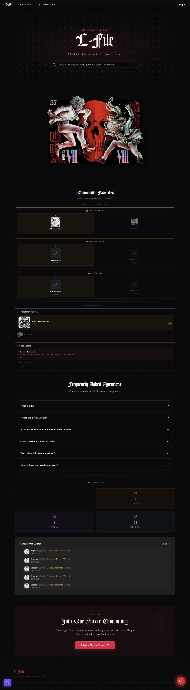
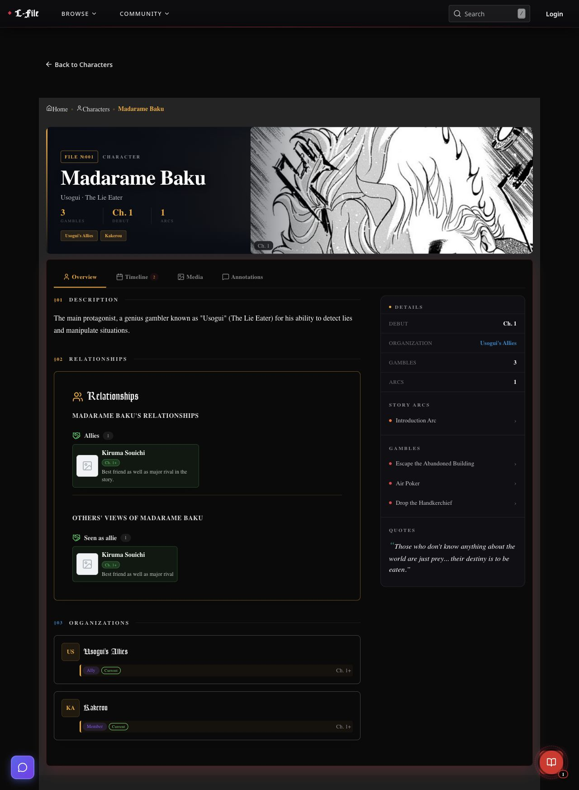
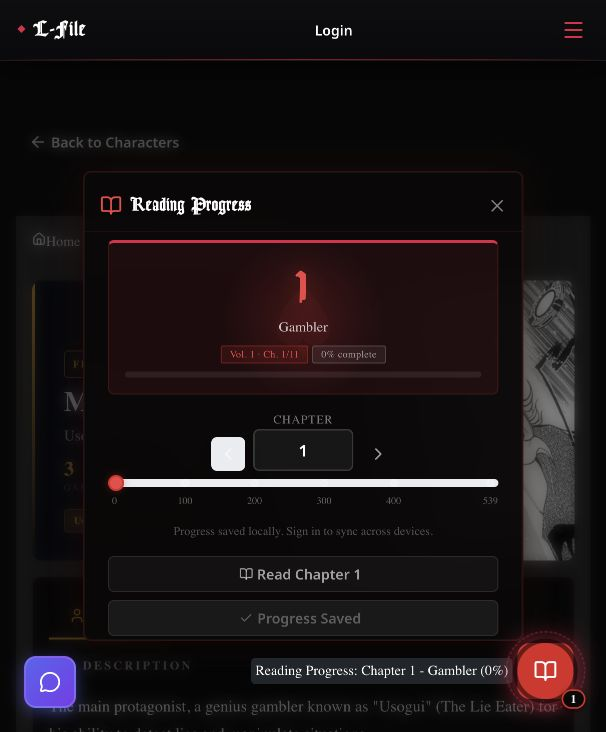

# L-File — building and operating a community database

[Back to the project overview](../../README.md)

An AI-assisted project in product planning, data organization, and self-hosting, built around a community database for readers of *Usogui*.

**Public deployment:** offline as of October 2026 (formerly l-file.com) · **Source:** [GitHub](https://github.com/ninjaruss/L-file) · **Project journal:** [My original showcase](https://www.ninjaruss.net/showcase/l-file) · **Development history:** August 2025–July 2026 in the reviewed checkout

My showcase post, published February 7, 2026, announced that the site was live. It was also accessible when these screenshots were captured on September 30, 2026. The captures preserve the public application ahead of its planned retirement; they remain available when the original domain is offline.

> Portfolio draft: the technical examples and live captures have been checked. The first-person reflections still need my review before publication.

## The project

I wanted a better resource for my favorite manga. In my original showcase, I described being frustrated with gaps in the existing fan wiki and an interface crowded with ads. L-File was my attempt to build the resource I wanted to use while reading and revisiting the story.

Readers can explore characters, story arcs, gambles, and their connections. The application also includes reading-progress controls, community submissions, user accounts, and an administration interface. My aim was to make something other fans could eventually help fill out; building the application and attracting contributions were separate challenges.

The biggest areas of learning for me were deciding what the product should contain, organizing the information behind it, and moving to self-hosting. The work extended from the public interface to the API, relational data model, authentication, content management, and deployment. I used AI coding tools throughout development and kept notes on the decisions, mistakes, and unfamiliar concepts I encountered.

*Live homepage: search, illustrated volume showcase, community favorites, and public site statistics. These are captures of the deployed application, not design mockups.*

## What the application brought together

| Area | Implemented capabilities |
| --- | --- |
| Connected content | Character profiles, arcs, chapters, volumes, gambles, organizations, and relationships |
| Reader experience | Chapter-based spoiler handling, reading progress, timelines, media, and favorites |
| Community contributions | Guides, media submissions, annotations, and moderation workflows |
| Content management | React Admin interface, role checks, and edit history |
| Accounts | Fluxer OAuth2, email/password authentication, and access/refresh token handling |
| Operations | Separate frontend and API services, Docker images, GitHub Actions, and Dokploy deployment configuration |

**Stack:** Next.js 15, React 19, TypeScript, Mantine, Tailwind CSS, NestJS, TypeORM, PostgreSQL, Cloudflare R2, and Resend. The deployment documentation describes a Hetzner VPS managed through Dokploy.

## Three problems that made this a learning project

### 1. Deciding what the product needed to do

Part of the work was figuring out which features and pages belonged in the product. Two ideas came directly from experiences I wanted to recreate: character-based profile images were inspired by old Dueling Network profiles, and chapter-progress spoiler controls came from wanting to use the database alongside a long read. Those choices gave the site a purpose beyond collecting information.

A reader needs ways to find a character, understand a gamble, and follow connections through the story. Someone maintaining the database needs ways to enter, correct, and review that information.

An early decision was to build an administration interface rather than use a linked spreadsheet. My August 2025 notes record the concern that chapter-specific spoilers and events would become difficult to manage as the number of entries grew. The resulting application separates public browsing from content management and gives community submissions their own review workflows.

This made product planning tangible: a feature needed both a useful place in the reader's experience and a workable way to maintain its data. The current character page shows that relationship between the product and its underlying structure.

### 2. Turning a story into structured data

A character can belong to an organization, participate in several gambles, and support a particular side within one match. Treating all of these as free-text descriptions would make it harder to navigate connections or keep repeated information consistent.

The implementation uses related records for characters, organizations, gambles, factions, and faction members. A faction belongs to a specific gamble and can identify the gambler it supports. Its members can have roles such as leader, supporter, or observer.

Reading progress adds another dimension: information that is useful to one reader may spoil the story for another. The client compares chapter-tagged content with reading progress or a chosen spoiler threshold and supports a show-all override. This is a reader-facing display preference, not an authorization boundary.

The admin dashboard exposed how easily these layers could fall out of step. My original showcase records editing and saving problems after changes to the data structure. At the time, I suspected generated changes were not consistently updating the frontend/backend API connections. That was a working diagnosis, but it identified something concrete I needed to understand: how an edit travels from a form through the API to stored data.

The lesson I would carry forward is to describe both the information and how people will use it before asking for implementation. Those details helped turn a broad idea into more specific development tasks.

*Madarame Baku’s public profile, captured September 30, 2026. The capture shows the navigation and main content, bringing several parts of the data model into one navigable view.*

### 3. Moving to self-hosting and working through deployment constraints

Moving to self-hosting was one of the biggest learning steps in this project. I moved the frontend from Vercel and the backend from Fly.io to a self-funded Hetzner server managed through Dokploy. Its management interface made self-hosting more approachable, while the migration introduced work with firewall ports, service routing, registry credentials, and deployment webhooks.

The small server became overloaded when building frontend changes. I learned to move that build into GitHub Actions, produce a Docker image, and have the server pull the prepared image. After trial and error, pushes could trigger the frontend build and deployment automatically.

The March 22 showcase update still records occasional overload and a deployment step that needed a later retry. The repository shows further work after that account: moving backend builds into GitHub Actions too, serializing deployment work, and adjusting container memory limits. The current configuration builds both images in GitHub Actions, publishes them to GitHub Container Registry, and triggers Dokploy to pull them.

The important change in my understanding was separating the work of building the application from the work of running it. A deployment problem gave me a concrete reason to learn how the services fit together and to keep investigating after an initial improvement.

See the [deployment architecture](../DEPLOYMENT.md), [frontend workflow](../../.github/workflows/deploy-frontend.yml), and [backend workflow](../../.github/workflows/deploy-backend.yml).

## How I used AI and learned from the work

I used Claude Code extensively, and my original showcase is candid about how much code was generated. My contribution included defining the product, organizing its data, describing the behavior I wanted, evaluating the results, and working through deployment. I also recorded where my frontend experience limited my ability to customize and diagnose the interface.

My process became more explicit as the project developed. I described turning rough ideas into implementation plans, then using planning and design skills to focus the work. Comparing live mockups helped me decide what I wanted before committing to an interface.

Those tools still missed related components and introduced unintended changes. My March update describes spending additional time repairing them. Earlier notes record a timeline request that also changed existing timelines I had wanted to preserve. These experiences gave me reasons to specify scope more carefully, inspect connected behavior, and distinguish code I could follow from behavior I could confidently troubleshoot.

For me, the accomplishment was taking a niche idea through product decisions, implementation, public deployment, and continued revision. The learning came from the places where the result did not match my intent and I had to understand enough to move it forward.

## Technical details worth discussing

Two examples show the kinds of behavior behind the interface:

- **Concurrent session refresh:** the API client shares an in-progress refresh promise so several requests can wait on one token refresh. Access tokens are held in memory; the backend sets refresh tokens in an httpOnly cookie.
- **Moderation beyond the screen:** the guides service restricts which pending or rejected submissions callers can read and checks privileges before approval or rejection. Hiding an administrative button is only one part of controlling an operation.

*The deployed reading-progress dialog offers chapter selection and explains local persistence versus signing in to sync progress. Captured September 30, 2026.*

## Preserving the work

L-File reached a public deployment, and its source history records continued development, redesign, and maintenance. This case study preserves the visible result alongside examples of the technical decisions behind it.

The hosted application is now offline. The screenshots are stored with this document, and the code and deployment records provide further material for discussing the project.

*L-File is an unofficial fan project. Usogui artwork and characters belong to their respective rights holders. The work presented here is the application and its implementation.*
